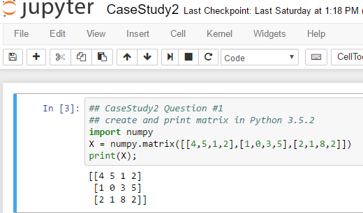
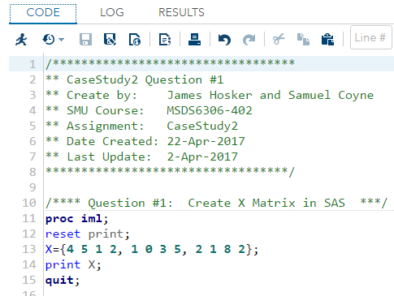
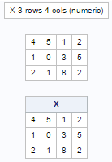

```{r setup, include=FALSE}
knitr::opts_chunk$set(echo = TRUE)
```

# Introduction
This report answers 5 critical questions asked in Case Study 2 for MSDS 6306-402 (Thursday, 6:30 - 8:00 PM).

>    First, we will create and print out Matrix X in R, Python and SAS.  Second, we will calculate and plot the Automatic Data Processing (ADP) volatility decayed over 10, 30 and 100 days.  Third, we will calculate the mean and median circumference of five different trees; plot a scatterplot of trunk circumference vs. the age of the tree; and plot a boxplot of the tree type versus its circumferences.  Fourth, we will look at the maximum and minimum monthly average temperature over a period of years by Country ("TEMP.csv") and by City ("Citytemp.csv"") and compare them.   We will examine the average monthly and yearly temperatures for the United States (US), converted from Celsius to Fahrenheit.  In addition, we will look at the average temperature difference between years.  Finally, we will plot using polar coordinates.  

# Folder Description

The URL with the code and our analysis is on the GitHub website:  [\textcolor{blue}{https://github.com/jjhosker/CaseStudy2}](https://github.com/jjhosker/CaseStudy2.git).  It contains the following important files:

>1.  README:  This file provides instructions on how to run the R code and provides information in detail of each of the files in the GitHub repository.

>2.  RMakefile_CaseStudy2.R:  This file can be found in the Analysis sub-directory under the CaseStudy2 GitHub repository.   It is the main R makefile with the function calls. 

>3.  Makefile_GatherData.R:  This file can be found in the Analysis/Data sub-directory under CaseStudy2 GitHub repository.  This R makefile installs all required R-libraries and then loads the R-libraries.  Second, this R makefile uploads the TEMP.csv and CityTemp.csv data files with monthly average temperature data by country and by city, respectively.  This makefile also creates the raw data, and creates the cleaned datasets.   In cleaning the data, we read in the csv files; we remove NAs and blanks in the data; and we reformat the date data.  This makefile then saves all these datasets to the Analysis/Data sub-directory.

>4.  RFunctions_CaseStudy2.R:  This file can be found in the Analysis sub-directory under the CaseStudy2 GitHub repository.   This file contains functions that are loaded and used the main R makefile(RMakefile_CaseStudy2.R). 

>5.  In addition to the two raw data sets, there are three data files created below and three PNG files which are loaded into the PDF file on creation.   In addition, we provide a text file (SessionsInfo.txt) containing all the R session information including the current R version and all the libraries and packages being utilized.  All the files below can be found in the Analysis/Data sub-directory under this GitHub repository.
>     - Raw:  TEMP.csv
>     - Raw:  CityTemp.csv
>     - Cleaned:  TEMPclean.csv
>     - Cleaned:  CityTempclean.csv
>     - R version:  SessionInfo.txt
>     - PNG:  SAS_MatrixCode.PNG
>     - PNG:  SAS_MatrixOutput.PNG
>     - PNG:  Python_Matrix.PNG

>6.  Finally, the CaseStudy2PDF.Rmd file runs the main RMakefile_CaseStudy2.R and extracts code to generate this "CaseStudy2PDF.pdf"" report.   This report uses code that that is extracted from the main RMakefile_CaseStudy2.R and then run.
>     - To use this Rmd file to create a PDF, the user has to install MikTex (the non-basic version).  The URL with instructions to install MikTex is [\textcolor{blue}{MikText Install website}](https://miktex.org/howto/install-miktex).

# Running the R-Code

Before beginning please review the README.md file in GitHub website [\textcolor{blue}{https://github.com/jjhosker/CaseStudy2}](https://github.com/jjhosker/CaseStudy2).  In short, download and clone the GitHub repository and the sub-directories.  RMakefile_CaseStudy2.R should be executed in the Analysis sub-directory of this GitHub repository; and CaseStudy2PDF.Rmd can be executed from this GitHub repository.  

>1.  In the Analysis sub-directory in this repository, execute the main R source code RMakefile_CaseStudy2.R, which performs the analysis for this report. 
>     - The RMakefile_CaseStudy2.R loads function in the RFunctions_CaseStudy2.R and executes the makefile Makefile_GatherData.R in the Analysis/Data directory.  Makefile_GatherData.R installs the packages, loads the libraries and cleans the raw data.  A message indicating that the libraries loaded may appear after executing the R code that follows.  
>     - If a failure occurs, please check the function "packagelibrary.check" in the Makefile_GatherData.R and/or the SessionInfo.txt file, both found in the Analysis/Data sub-directory of the CaseStudy2 GitHub repository.

>2. To generate this PDF report, execute CaseStudy2PDF.Rmd in this GitHub repository.  Please note the required installations of software to generate the PDF is detailed in the prior section, Folder Description. 

### Here, we execute RMakefile_CaseStudy2.R to generate all the analysis used in this report.

```{r results='hide', message=FALSE, warning=FALSE}
###################################################
## Execute Main RMakefile_CaseStudy2.R Makefile
###################################################
source("Analysis/RMakefile_CaseStudy2.R")
```

\newpage
# Five Major Questions for CaseStudy2:    

## Question #1: Create the X matrix and print it from SAS, R, and Python.

### R-Code and Output of Matrix X
>   a. The R code below prints the necessary information for creation of the matrix.   For more details in R, see R-code section for Question #1 in RMakefile_CaseStudy2.R.

```{r}
## See R-code in RMakefile_CaseStudy2.R
xlist <- c(4,5,1,2,1,0,3,5,2,1,8,2)
X <- matrix(xlist,nrow=3,ncol=4,byrow=TRUE)
print(X)
```

>   b.  We read in a PNG file below showing the execution of the code in Python using Jupyter.

### Fig. 1: Python-code and Output of Matrix X


\newpage
>   c. We read in the two PNG files below showing the execution of the code in SAS using Jupyter on the next page.

### Fig.2: SAS-code and Output of Matrix X




\newpage
## Question #2: We do the following with your assigned stock:  ADP. 
> The R code below prints the necessary information for creation of plot on volatility.   For more details in R, see R-code section for Question #2 in RMakefile_CaseStudy2.R.

>   •	We downloaded the data for the stock Automatic Data Processing (ADP) from January 2000 to the current date and print out the graph below.

```{r}
plot(ADPdata,xlab="Date",ylab="Price ($)", 
     main= "Fig. 3: Price of Automatic Data Processing (ADP)")
```

>   •	We calculated the daily log returns for ADP over the same period.

>   •	Calculate volatility measure over the entire series from Jan 2000 to the current date.

```{r}
print(paste("ADP volatility of series from 01-Jan-2000 to 23-Apr-2017: ",round(ADPvol,2),"%"))

```

>   •	We calculate volatility over entire length of series for various three different decay factors: 10, 30 & 100 days.

>   •	Now we plot the results, overlaying the volatility curves on the data, just as was done in the S&P example but now for ADP

```{r}
## Below in CaseStudy2PDF.Rmd file
plot(x=ddates,y=ADPvol_10d,type="s",xlab="Date", ylab="Volatility (decayed)", 
     main="Fig. 4: ADP Volatility using 10, 30 and 100 Day Decay", lty=2)
 lines(x=ddates,y=ADPvol_30d,type="s", col="red",lty=4)
 lines(x=ddates,y=ADPvol_100d,type="s", col="blue",lty=1)
 legend(as.Date("2011-01-02"), 0.08, legend=c("10d Decay", "30d Decay", "100d Decay"),
        col=c("black","red","blue"), lty=c(2,4,1), cex=0.8)
 
```

\newpage
## Question #3: We perform the following on the Orange data set. 
> The R code below prints the necessary information for creation of plots.   For more details in R, see R-code section for Question #3 in RMakefile_CaseStudy2.R.

###     Q#3.a:  Calculate the mean and the median of the trunk circumferences for different size of the trees. (Tree)

```{r}
## calculate the mean of trunk circumference for different Tree sizes
print(paste("Mean Trunk Circumference:"))
print(TrunkMeanCir)
## calculate the median of trunk circumference for different Tree sizes
print(paste("Median Trunk Circumference:"))
print(TrunkMedCir)

```

\newpage
###     Q#3.b:	Make a scatter plot of the trunk circumferences against the age of the tree. Use different plotting symbols for different size of trees.

```{r}
## make a scatterplot of age vs. circumference with different plotting symbols
ggplot(Orange, aes(x=circumference, y=age, shape=Tree, colour=Tree)) + 
       geom_point() + scale_colour_brewer(palette="Set1") +
       ggtitle("Fig. 5: Scatterplot of Tree Age vs. Circumference")
```

\newpage
###     Q#3.c:	Display the trunk circumferences on a comparative boxplot against tree. Be sure you order the boxplots in the increasing order of maximum diameter.

```{r}
## make a comparative boxplot of tree vs. circumference, displayed 
## in increasing order of max circumference
ggplot(Orange, aes(x=Tree, y=circumference)) + geom_boxplot() +
       ggtitle("Fig. 6: BoxPlot of Tree vs. Circumference")

```

\newpage
## Question #4: Analyze the TEMP.csv data
> The R code below prints the necessary information for creation of plots.   For more details in R, see R-code section for Question #4 in RMakefile_CaseStudy2.R.

###     Q#4.i: Below is table and graph of difference between the maximum and the minimum monthly average temperatures for each country, for which we report and visualize the top 20 countries with the maximum differences for the period since 1900 from TEMP.csv.

```{r}
## R Code for CaseStudy2PDF.Rmd for Summary Table output 
kable(top_20_country, format="pandoc", align='c',row.names = FALSE,
      col.names = TableNames, 
      caption = "Top 20 Countries with Largest Monthly Avg Max - Min Temp. (1900 TO 2013)")

#make a visual of top 20 countries and their temp difference
visual1 <- ggplot(top_20_country, aes(x=difference, y=reorder(Country, difference))) + 
           geom_point(size=3) + ylab("Country") + theme_bw() + 
           theme(panel.grid.major.x=element_blank(), panel.grid.minor.x = element_blank(), 
           panel.grid.major.y = element_line(colour="grey60", linetype="dashed")) +
           ggtitle("Fig. 7: Top 20 Monthly Avg Max-Min Temp by Country (1900 to 2013)")

#show the plot
visual1

```

\newpage
###     Q#4.ii.a:  Create a new column to display the monthly average land temperatures in Fahrenheit (°F).

```{r}
## plot UStemp monthly avg temp for USA
plot(UStemp$Date2, UStemp$MthAvgTemp.Fahrenheit,type="s",xlab="Date", 
     ylab="Monthly Avg. Temp (degr-F)", 
     main="Fig. 8: Monthly Average Temperature for USA (Fahrenheit)")

```

###     Q#4.ii.b:  Calculate average land temperature by year and plot it. The original file has the average land temperature by month. 

```{r}
## make a table of yearly temp in US 
kable(TableFrame, format="pandoc", align='c',row.names = FALSE,
      col.names = c("Year", "Yearly Temperature Avg. (Fahrenheit)"), 
      caption = "Yearly Avg. Temperature for USA (1990-2013)")
## make a visual of yearly temp in US 
visual3 <- ggplot(TableFrame, aes(x=Year, y=YearlyAvg)) + 
  geom_point(size=3) + ylab("Temperature (Fahrenheit)") + xlab("Year") + theme_bw() + 
  theme(panel.grid.major.x=element_blank(), panel.grid.minor.x = element_blank(), 
        panel.grid.major.y = element_line(colour="grey60", linetype="dashed")) +
  ggtitle("Fig. 9: Yearly Avg. Temperature for USA (1990-2013)")

#show the plot
visual3

```

###     Q#4.ii.c:  Calculate the one year difference of average land temperature by year and provide the maximum difference (value) with corresponding years.

```{r}
kable(TableFrame2, format="pandoc", align='c',row.names = FALSE,
      col.names = c("Range of Years", "Yearly Avg. Temp. Diff of Year - Prior Year (Fahrenheit)"), 
      caption = "Yearly Avg. Temperature Between Years for USA (1990-2013)")
print(paste("Largest avg. yearly temp. difference (+/-) for USA is:",
            SortBtwYrAvg$Diff[1]," Fahrenheit (",SortBtwYrAvg$YearDiff[1],")"))

```

###     Q#4.iii:  Download “CityTemp” data set (check your SMU email). We find the difference between the maximum and the minimum temperatures for each major city and report/visualize top 20 cities with maximum differences for the period since 1900.

```{r}
## R Code for CaseStudy2PDF.Rmd for Summary Table output 
kable(top_20_cities, format="pandoc", align='c',row.names = FALSE,
      col.names = TableNames3, 
      caption = "Top 20 Cities with Largest Monthly Avg Max - Min Temp. (1900 TO 2013)")

#make a visual of top 20 cities and their temp difference
visual2 <- ggplot(top_20_cities, aes(x=difference, y=reorder(City, difference))) + 
           geom_point(size=3) + ylab("City") + theme_bw() + 
           theme(panel.grid.major.x=element_blank(), panel.grid.minor.x = element_blank(), 
           panel.grid.major.y = element_line(colour="grey60", linetype="dashed")) +
           ggtitle("Fig. 10: Top 20 Monthly Avg Max-Min Temp by City (1900 to 2013)")

#show the plot
visual2

```

###     Q#4.iv: Compare the two graphs in (4.i) and (4.iii) and comment on it below:

>   1. We notice that cities in China (e.g. Harbin, Changchun, Shenyang, Taiyuan, Peking, Tianjin and others) are in the top 20 cities with the largest monthly average temperature difference in Celsius between the maximum and minimum from 1900 to 2013 but China as a country is not in the to 20 countries with the largest monthly difference between the maximum and minimum temperature.  However, nearby countries like Mongolia are.

>   2. We notice that the cities of Montreal and Toronto in Canada are in the top 20 cities with the largest difference in monthly average temperature and Canada is one of the top 20 countries with the largest monthly difference between the maximum and minimum temperature.  

>   3. We notice that the cities of Moscow and Saint Petersburg in Russia are in the top 20 cities with the largest difference in monthly average temperature and Russia is one of the top 20 countries with the largest monthly difference between the maximum and minimum temperature.  In addition countries nearby such as Kazakhstan, Uzbekistan, Estonia, Ukraine and other are on the top countries with the largest monthly difference between the maximum and minimum temperature.   

>   4. We notice that the cities of New York and Chicago in the Unites States are in the top 20 cities with the largest difference in monthly average temperature but overall the United States is not in the top 20 countries with the largest monthly difference between the maximum and minimum temperature.  

## Question #5: Semester Bonus Question

> We Run the R-code below and print out the graph.  For more details in R, see R-code section for Question #5 in RMakefile_CaseStudy2.R.

```{r echo = TRUE}
##  Question #5:  Semester End Bonus Plot
t<-seq(0,10,length=1000)
x<-sqrt(t)*cos(2*pi*t)
y<-sqrt(t)*sin(2*pi*t)
plot(x,y,axes=F,type="l",lwd=3,xlab="x(t)",ylab="y(t)",col="red")

axis(1,at=seq(-3,3,by=0.5),labels=seq(-3,3,by=0.5))
axis(2)
box()
title(main=expression(
  paste("Fig. 11: (x(t),y(t)) with polar coordinates",
        (list(sqrt(t),2*pi*t))
  )))

```

\newpage
# Conclusions:

> In this report, we answer five questions/tasks and have provided five answers.  

>    1. We created and printed out Matrix X in R, Python and SAS.

>    2. We downloaded the daily stock prices for Automatic Data Processing (ADP) from Yahoo finance and plotted it.  We then calculated and plotted the ADP volatility decayed over 10, 30 and 100 days.

>    3. We analyzed the native "Orange"" data set and calculated the mean and median circumference of five different trees; plotted a scatterplot of trunk circumference vs. the age of the tree; and plotted a boxplot of the tree type versus its circumferences.

>    4. We uploaded the "TEMP.csv" and "CityTemp.csv"" data set and found the difference in the maximum and minimum monthly average temperature over a period of years by Country ("TEMP.csv") and buy City ("Citytemp.csv"").   In addition, we compared the two outputs by City versus Country.   Moreover, we selected a subset of average monthly temperatures for the United States (US); converted them from Celsius to Fahrenheit; calculated the average yearly temperature; and calculated the difference in maximum and minimum temperatures by year. 

>    5. Finally, we plotted a graph with x and y polar coordinates.  
